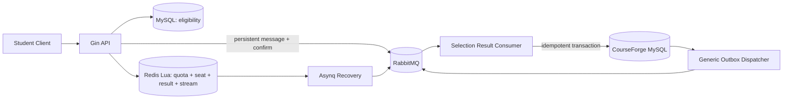

# CourseForge

CourseForge 是一个使用 Go 实现的高并发选课系统。目前主链路覆盖选课资格校验、
Redis Lua 原子预占、RabbitMQ Confirm、异步 MySQL 落库、失败恢复与可观测性。

## 核心能力

- **原子选课决策**：Redis Lua 在一次执行中校验学生额度、课程重复选择和教学班名额，
  同时保存申请结果并写入 Redis Stream，避免并发超卖。
- **可靠异步落库**：请求成功前等待 RabbitMQ Publisher Confirm；消费者使用 MySQL
  事务和唯一约束完成幂等持久化。
- **失败恢复**：Asynq 定时扫描未确认的 Redis Stream 结果并重新投递。
- **通用 Outbox**：业务事务内写入 `outbox_event`，后台任务负责抢占、发布确认、
  失败退避和过期租约恢复，可直接复用于后续视频、弹幕等模块。
- **工程化设施**：保留 DBRouter、RabbitMQ、Asynq、CDC、Elasticsearch、
  Prometheus、Grafana、真实依赖集成测试和选课 benchmark。
- **可扩展入口**：API 当前提供选课接口；Admin 保留独立服务与路由注册骨架，
  便于后续接入课程、视频和弹幕管理。

## 主链路



## 快速开始

环境要求：Go 1.25+、Docker、Docker Compose。

启动临时 MySQL、Redis 和 RabbitMQ：

```bash
make integration-up
```

复制并调整本地配置：

```bash
cp configs/config.example.yaml configs/config.yaml
```

启动服务：

```bash
make run-api
make run-admin
```

默认接口：

- `POST /api/v1/enrollments`
- `GET /healthz`
- `GET /readyz`
- Admin：`GET /admin/v1/status`

销毁临时依赖：

```bash
make integration-down
```

## 测试与压测

```bash
# 格式、静态检查、单元测试和部署脚本测试
make check

# 真实 MySQL、Redis、RabbitMQ 集成测试
make integration-test

# 构建选课压测工具
make build-benchmark
./bin/courseforge-benchmark prepare --help
./bin/courseforge-benchmark run --help
```

压测工具会准备隔离的高位 ID 测试数据，并验证选课成功数、Redis 剩余名额和 MySQL
最终落库数量。完整参数见 [压测工具说明](cmd/benchmark/README.md)。

## 可观测性与数据同步

- Prometheus 指标使用 `courseforge` namespace，覆盖 HTTP、选课、异步落库、
  Redis、RabbitMQ、Asynq、Outbox 和 MySQL 连接池。
- Grafana 自动加载 `CourseForge Overview` Dashboard。
- CDC 默认订阅 `courseforge\..*`，并写入 `courseforge_<table>` Elasticsearch 索引。
- `make monitoring-up` 启动 Prometheus、Grafana 和 MySQL Exporter。
- `make search-up` 启动 Elasticsearch、Kibana 和 CDC Sync。

## 项目结构

```text
cmd/                    API、Admin、CDC 与 benchmark 入口
internal/application/   选课应用编排
internal/domain/        选课与通用 Outbox 模型
internal/infrastructure/数据库、缓存、消息队列与仓储实现
internal/listener/      通用 RabbitMQ Consumer 与选课结果监听器
internal/job/           结果恢复与 Outbox 任务
server/http/            Gin 路由和 Handler
tests/integration/      真实依赖集成测试
monitoring/             Prometheus 与 Grafana
deploy/                 生产 Compose 与部署脚本
docs/sql/               CourseForge 数据库初始化脚本
```

## 当前边界

当前版本已完成选课主链路，但认证、完整请求级幂等查询、申请状态查询、退课、
候补和更复杂的业务规则仍是后续工作。详见仓库上层的 `problem.md`。
